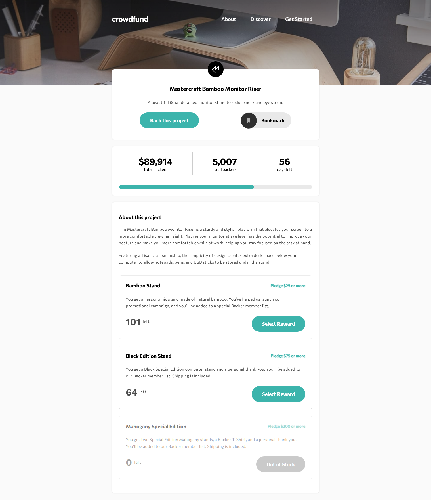

# Frontend Mentor - Crowdfunding product page solution

This is a solution to the [Crowdfunding product page challenge on Frontend Mentor](https://www.frontendmentor.io/challenges/crowdfunding-product-page-7uvcZe7ZR). Frontend Mentor challenges help you improve your coding skills by building realistic projects. 

## Table of contents

- [Overview](#overview)
  - [The challenge](#the-challenge)
  - [Screenshot](#screenshot)
  - [Links](#links)
- [My process](#my-process)
  - [Built with](#built-with)
  - [What I learned](#what-i-learned)
  - [Useful resources](#useful-resources)
- [Author](#author)
- [Acknowledgments](#acknowledgments)

## Overview

### The challenge

Users should be able to:

- View the optimal layout depending on their device's screen size
- See hover states for interactive elements
- Make a selection of which pledge to make
- See an updated progress bar and total money raised based on their pledge total after confirming a pledge
- See the number of total backers increment by one after confirming a pledge
- Toggle whether or not the product is bookmarked

### Screenshot



### Links

- Solution URL: [Add solution URL here](https://your-solution-url.com)
- Live Site URL: [Github Page](https://suleeyman.github.io/FM-5-Crowd/)

## My process

### Built with

- Semantic HTML5 markup
- CSS custom properties
- Flexbox
- Mobile-first workflow

### What I learned

I have learned how to design the layout of a form with `<label>` block. By nesting like this, I could add easiest CSS style.

```html
<label class="card" for="no-reward" data-spam="1">
      <header>
        <input type="radio" class="radio--input" name="select" id="no-reward" required>
        <div class="radio--radio"></div>
        <div class="subtitle">
          <h3>Pledge with no reward</h3>
        </div>
      </header>
      <p>Choose to support us without a reward if you simply believe in our project. As a backer, 
        you will be signed up to receive product updates via email.
      </p>
</label>
```

It's also my first usage of `.closest()` method in JS. And It's very helpfull for EventListerner !

```js
const card = e.target.closest('.card')
```
### Useful resources

- [Design radio input](https://www.youtube.com/watch?v=5K7JefKDa4s) - This helped me for designin radio inputs in select modal.

## Author

- Frontend Mentor - [@Suleeyman](https://www.frontendmentor.io/profile/Suleeyman)